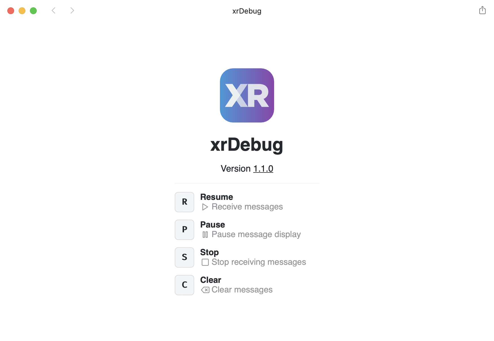
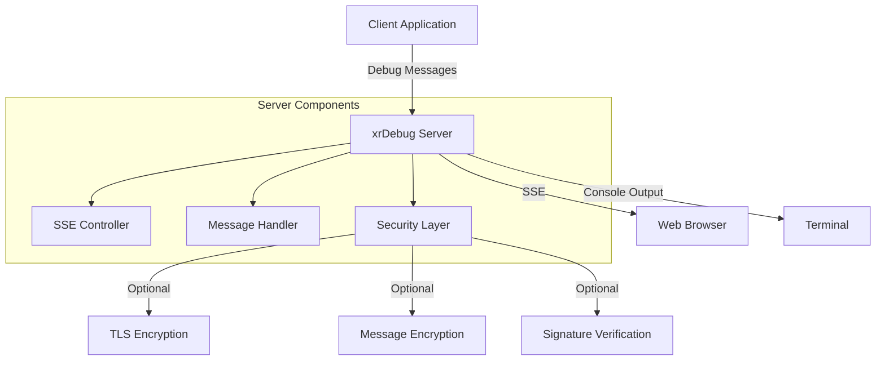
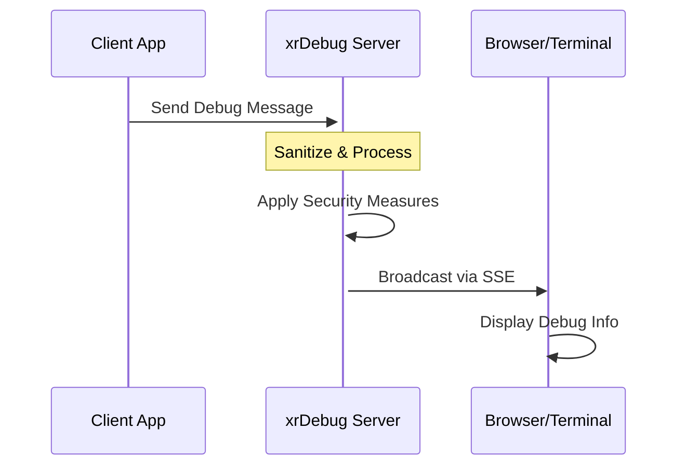

# xrDebug

[xrDebug](https://xrdebug.com/) is a lightweight web-based debug server. [Play video](https://xrdebug.com/xrdebug.mp4)

<a href="https://github.com/xrdebug/xrdebug/releases/latest"></a>

<a href="https://xrdebug.com"></a>

[](https://github.com/xrdebug/xrdebug/actions)

[](LICENSE)

## Installation

xrDebug is available for Windows, macOS, and Linux. Download the latest xrdebug binary from the [releases page](https://github.com/xrdebug/xrdebug/releases/latest).

### From binary

1. Go to the [releases page](https://github.com/xrdebug/xrdebug/releases/latest).
2. Download the appropriate binary for your operating system.
3. Extract the downloaded file.
4. Move the binary to a directory included in your `PATH`.

Optionally, you can run this command to install the latest version:

```sh
bash <(curl -sL xrdebug.com/bin.sh)
```

### From source

Ensure you have [Go](https://golang.org/dl/) installed.

```sh
go install github.com/xrdebug/xrdebug@latest
```

## Screens




## Usage

Run the server with the following command:

```sh
xrdebug <options>
```

See the [run documentation](https://docs.xrdebug.com/run) for options.

### Options

- `-a`: IP address to listen on (default: ``)
- `-p`: Port to listen on (use `0` for random, default: `27420`)
- `-c`: Path to TLS certificate file
- `-z`: Path to TLS private key
- `-e`: Enable end-to-end encryption (default: `false`)
- `-k`: (for `-e` option) Path to symmetric key (AES-GCM AE)
- `-s`: Enable sign verification (default: `false`)
- `-x`: (for `-s` option) Path to private key (ed25519)
- `-n`: Session name (default: `xrDebug`)
- `-i`: Editor to use (default: `vscode`, options: `atom`, `bracket`, `emacs`, `espresso`, `fleet`, `idea`, `macvim`, `netbeans`, `nova`, `phpstorm`, `sublime`, `textmate`, `vscode`, `zed`)

### Clients

The following clients are available:

- PHP client: [xrdebug/php](https://github.com/xrdebug/php)
- WordPress plugin: [xrdebug/wordpress](https://github.com/xrdebug/wordpress)

(Contributions for other clients are welcome!)

## Documentation

Documentation available at [docs.xrdebug.com](https://docs.xrdebug.com/).

## System architecture

xrDebug follows a modular architecture with the following key components:



### Core Components

The system consists of these main components:

1. **Server**
   - Handles incoming debug messages
   - Manages SSE connections
   - Implements security measures
   - Provides HTTP endpoints

2. **Message Handler**
   - Processes incoming debug data
   - Sanitizes content
   - Manages message queuing
   - Handles message broadcasting

3. **Security Layer**
   - TLS encryption for HTTPS
   - End-to-end message encryption
   - Request signature verification

4. **Client Interface**
   - Real-time updates via SSE
   - Message decryption
   - Interactive debugging tools (pause, resume, stop)
   - Editor integration (jump to file, line)

### Data flow



## HTTP API

To send a message to the server, make a POST request to the `/messages` endpoint. All parameters are optional: `body`, `emote`, `file_line`, `file_path`, `id`, `topic` (but at least one is required).

```sh
curl --fail -X POST \
    --data "body=My message" \
    --data "file_path=file" \
    --data "file_line=1" \
    http://localhost:27420/messages
```

Learn more about the [HTTP API](https://docs.xrdebug.com/api) at the documentation.

## Signed requests

Request signing using Ed25519 digital signatures to verify message authenticity. To use signed requests pass the `-s` flag to the server. Optionally, you can pass the private key using the `-x` flag.

To sign a request, the client must include the `X-Signature` header. The signature is a base64 encoded string generated by signing the serialized post fields with the private key. If there's no fields sign an empty string.

### Sign workflow

To sign a request server expect the following data workflow:

1. Sort the post fields by key
2. Concatenate the key-value pairs
3. Sign the concatenated string
4. Base64 encode the signature at `X-Signature` header

Example in PHP:

```php
function serialize(array $data): string
{
    $result = '';
    ksort($data);
    foreach ($data as $key => $value) {
        $result .= $key . $value;
    }

    return $result;
}

$serialized = serialize($data);
$signature = $privateKey->sign($serialized);
$signHeader = base64_encode($signature);
```

Example in Python:

```python
def serialize(data: dict) -> str:
    return ''.join(f'{k}{v}' for k, v in sorted(data.items()))

serialized = serialize(data)
signature = private_key.sign(serialized)
signHeader = base64.b64encode(signature).decode()
```

The `X-Signature` header should contain the base64 encoded signature generated by the client.

```sh
curl --fail -X POST \
    --data "body=My signed message" \
    --data "file_path=file" \
    --data "file_line=1" \
    -H "X-Signature: <signHeader>" \
    http://127.0.0.1:27420/messages
```

## End-to-End encryption

End-to-end encryption between xrDebug server and the debugger client. To enable end-to-end encryption pass the `-e` flag. Optionally, you can pass the symmetric key using the `-k` flag.

The SSE stream at `/stream` will be encrypted using the symmetric key. Decryption happens on the client-side (web browser).

## License

Copyright [Rodolfo Berrios A.](https://rodolfoberrios.com/)

xrDebug is licensed under the Apache License, Version 2.0. See [LICENSE](LICENSE) for the full license text.

Unless required by applicable law or agreed to in writing, software distributed under the License is distributed on an "AS IS" BASIS, WITHOUT WARRANTIES OR CONDITIONS OF ANY KIND, either express or implied. See the License for the specific language governing permissions and limitations under the License.
