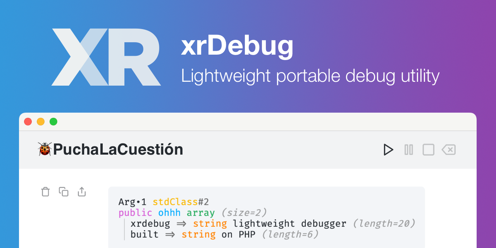

# xrDebug

[xrDebug](https://xrdebug.com/) is a lightweight web-based debug software. [Play video](https://xrdebug.com/xrdebug.mp4)

<a href="https://github.com/xrdebug/xrdebug/releases/latest"></a>

<a href="https://xrdebug.com"></a>

[](https://github.com/xrdebug/xrdebug/actions)

[](LICENSE)

## Installation

xrDebug is available for Windows, macOS, Linux and FreeBSD. Download the latest xrdebug binary from the [releases page](https://github.com/xrdebug/xrdebug/releases/latest).

### From binary

1. Go to the [releases page](https://github.com/xrdebug/xrdebug/releases/latest).
2. Download the appropriate binary for your operating system.
3. Extract the downloaded file.
4. Move the binary to a directory included in your `PATH`.

Optionally, you can run this command to install the latest version:

```sh
bash <(curl -sL xrdebug.com/bin.sh)
```

### From source

Ensure you have [Go](https://golang.org/dl/) installed.

```sh
go install github.com/xrdebug/xrdebug@latest
```

### Docker

Container images are available at [ghcr.io/xrdebug/xrdebug](https://github.com/xrdebug/xrdebug/pkgs/container/xrdebug).

Run the following command to start the server at port `27420`:

```sh
docker run -t --init --rm --pull=always -p 27420:27420 ghcr.io/xrdebug/xrdebug:latest
```

## Usage

Run the server with the following command. Use a [client library](#client-libraries) or the [HTTP API](#http-api) to send messages to the server.

```sh
xrdebug <options>
```

See the [run documentation](https://docs.xrdebug.com/run) for examples.

### Options

- `-a`: IP address to listen on (default: ``)
- `-p`: Port to listen on (use `0` for random, default: `27420`)
- `-c`: Path to TLS certificate file
- `-z`: Path to TLS private key
- `-e`: Enable end-to-end encryption (default: `false`)
- `-k`: (for `-e` option) Path to symmetric key (AES-GCM AE)
- `-s`: Enable sign verification (default: `false`)
- `-x`: (for `-s` option) Path to private key (ed25519)
- `-n`: Session name (default: `xrDebug`)
- `-i`: Editor to use (default: `vscode`, options: `atom`, `bracket`, `emacs`, `espresso`, `fleet`, `idea`, `macvim`, `netbeans`, `nova`, `phpstorm`, `sublime`, `textmate`, `vscode`, `zed`)

## Client libraries

The following clients are available:

- PHP client: [xrdebug/php](https://github.com/xrdebug/php)
- WordPress plugin: [xrdebug/wordpress](https://github.com/xrdebug/wordpress)

(Contributions for other clients are welcome!)

## Screens


## Documentation

Documentation available at [docs.xrdebug.com](https://docs.xrdebug.com/).

## Features

### Security & privacy

- Zero-persistence architecture - no data storage or logging
- Ed25519 signed requests
- End-to-end encryption using AES-GCM AE

### Real-time collaboration

- Automatic broadcast of debug messages to all connected peers
- Multiple developers can watch the same debug session simultaneously
- Real-time updates without page refresh
- Share debugging sessions across your team

### Advanced debugging

- Message filtering by Topics and Emotes
- Interactive debugging controls (Resume, Pause, Stop, Clear)
- Code execution flow control with pause/resume capabilities
- Customizable session naming for multiple debug instances

### Developer experience

- Intuitive keyboard shortcuts for rapid debugging (R, P, S, C)
- One-click export to clipboard or PNG format
- Seamless integration with popular code editors
- FiraCode font rendering

### Modern interface

- System-aware dark/light theme switching
- Fully responsive design for any screen size
- Portable HTML-based interface
- Clean, distraction-free debugging environment

## System architecture

xrDebug follows a modular architecture with the following key components:


### Core Components

The system consists of these main components:

1. **Server**
   - Handles incoming debug messages
   - Manages SSE connections
   - Implements security measures
   - Provides HTTP endpoints

2. **Message Handler**
   - Processes incoming debug data
   - Sanitizes content
   - Manages message queuing
   - Handles message broadcasting

3. **Security Layer**
   - TLS encryption for HTTPS
   - End-to-end message encryption
   - Request signature verification

4. **Client Interface**
   - Real-time updates via SSE
   - Message decryption
   - Interactive debugging tools (pause, resume, stop)
   - Editor integration (jump to file, line)

### Data flow


## HTTP API

Learn more about the [HTTP API](https://docs.xrdebug.com/api) at the documentation.

### GET /

To access the web interface, open a web browser and navigate to the server's root URL. The server will serve the web interface.

```sh
open http://localhost:27420
```

### POST /messages

Sends a message to the server.

**Parameters:**

All parameters are optional, but at least one is required.

- `body`: The message body.
- `emote`: The message type (default: `info`).
- `file_line`: The line number.
- `file_path`: The file path.
- `id`: The message ID.
- `topic`: The message topic.

**Responses:**

- `200 OK`: Message sent.
- `400 Bad Request`: Invalid request.

```sh
curl --fail -X POST \
    --data "body=My message" \
    --data "file_path=file" \
    --data "file_line=1" \
    http://localhost:27420/messages
```

### POST /pauses

Creates a pause lock.

**Parameters:**

- `id`: The ID of the pause lock.

The following parameters are optional:

- `body`: The message body.
- `emote`: The message type (default: `info`).
- `file_line`: The line number.
- `file_path`: The file path.
- `topic`: The message topic

**Responses:**

- `201 Created`: Lock created `Location: /pauses/{id}`.
- `409 Conflict`: Lock already exists.

```sh
curl --fail -X POST --data "id=123" http://localhost:27420/pauses
```

### GET /pauses/{id}

Retrieves the status of an existing pause lock.

**Parameters:**

- `id` (path): The ID of the pause lock.

**Responses:**

- `200 OK`: Returns the pause lock (JSON).
- `404 Not Found`: Lock not found.

```sh
curl --fail -X GET http://localhost:27420/pauses/123
```

### DELETE /pauses/{id}

Deletes a pause lock.

**Parameters:**

- `id` (path): The ID of the pause lock.

**Responses:**

- `204 No Content`: Lock deleted.
- `404 Not Found`: Lock not found.

```sh
curl --fail -X DELETE http://localhost:27420/pauses/123
```

### PATCH /pauses/{id}

Updates a pause lock status to `stop: true`.

**Parameters:**

- `id` (path): The ID of the pause lock.

**Responses:**

- `200 OK`: Lock updated, returns the pause lock (JSON).
- `404 Not Found`: Lock not found.

```sh
curl --fail -X PATCH http://localhost:27420/pauses/123
```

### GET /stream

Establishes a Server-Sent Events (SSE) connection.

**Responses:**

- `200 OK`: Returns the SSE stream.

```sh
curl --fail -X GET http://localhost:27420/stream
```

## Signed requests

Request signing using Ed25519 digital signatures to verify message origin authenticity. To use signed requests pass the `-s` flag to the `xrdebug` command. Optionally, you can pass the private key using the `-x` flag.

To sign a request, the client must include the `X-Signature` header on requests made to the xrDebug server. The signature is a base64 encoded string generated by signing the serialized post fields with the private key. If there's no fields sign an empty string.

### Sign workflow

To sign a request server expect the following data workflow:

1. Sort the post fields by key
2. Concatenate the key-value pairs
3. Sign the concatenated string
4. Base64 encode the signature at `X-Signature` header

Example in PHP:

```php
function serialize(array $data): string
{
    $result = '';
    ksort($data);
    foreach ($data as $key => $value) {
        $result .= $key . $value;
    }

    return $result;
}

$serialized = serialize($data);
$signature = $privateKey->sign($serialized);
$signHeader = base64_encode($signature);
```

Example in Python:

```python
def serialize(data: dict) -> str:
    return ''.join(f'{k}{v}' for k, v in sorted(data.items()))

serialized = serialize(data)
signature = private_key.sign(serialized)
signHeader = base64.b64encode(signature).decode()
```

The `X-Signature` header should contain the base64 encoded signature generated by the client.

```sh
curl --fail -X POST \
    --data "body=My signed message" \
    --data "file_path=file" \
    --data "file_line=1" \
    -H "X-Signature: <signHeader>" \
    http://127.0.0.1:27420/messages
```

## End-to-End encryption

End-to-end encryption (AES-GCM AE) between xrDebug server and the debugger web user interface client. To enable end-to-end encryption pass the `-e` flag. Optionally, you can pass the symmetric key using the `-k` flag.

The SSE stream at `/stream` will be encrypted using the symmetric key. Decryption happens on the client-side (web browser).

## License

Copyright [Rodolfo Berrios A.](https://rodolfoberrios.com/)

xrDebug is licensed under the Apache License, Version 2.0. See [LICENSE](LICENSE) for the full license text.

Unless required by applicable law or agreed to in writing, software distributed under the License is distributed on an "AS IS" BASIS, WITHOUT WARRANTIES OR CONDITIONS OF ANY KIND, either express or implied. See the License for the specific language governing permissions and limitations under the License.
